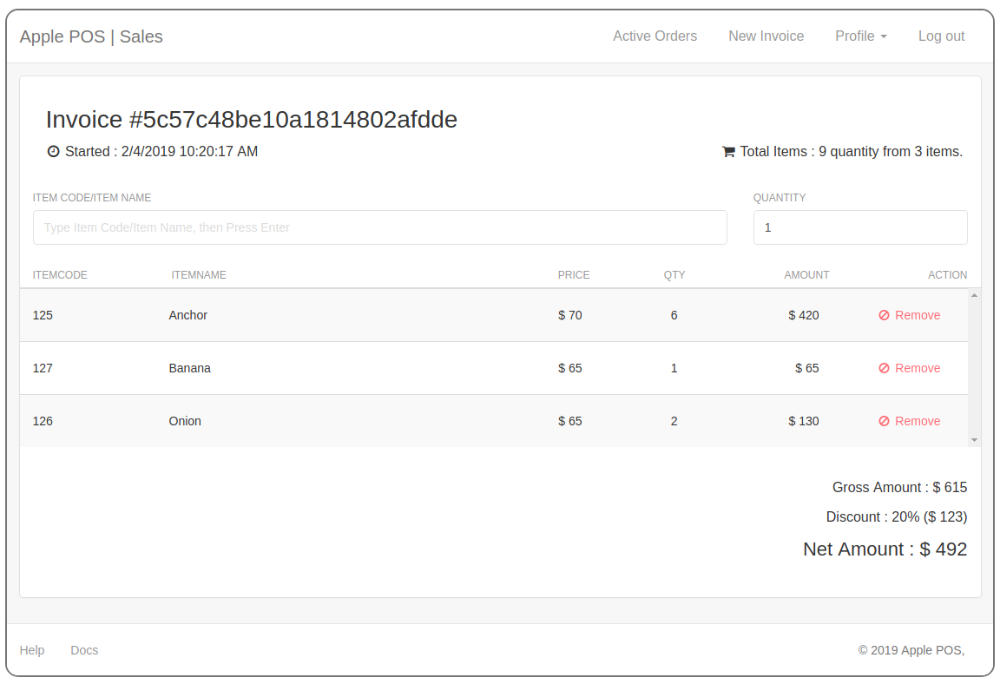

# POS-client

## How to run?

1. Clone and enter the project directory
2. run ```npm install``` command in your terminal
3. run ```npm start``` command, then the POS system will be launched in your default browser.

## Login Page


## Sales dashboard


## Order list dashboard

